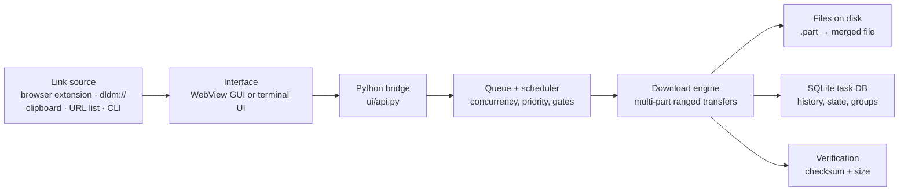
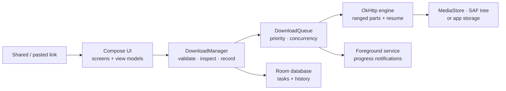
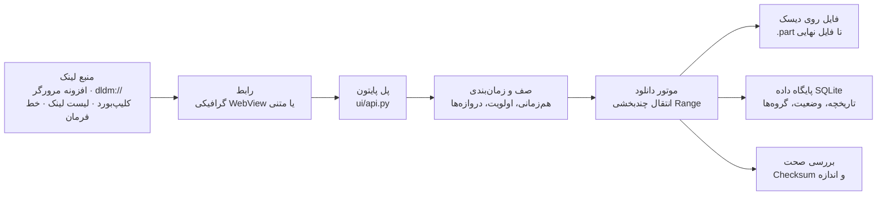
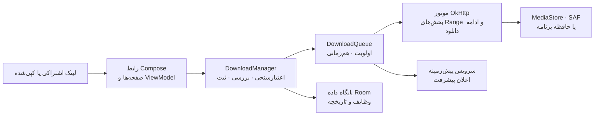

<div align="center">


# ⬇️ N13 Download Manager

**A multi-threaded download manager for Windows and Android — start, queue, schedule, organize, see through and verify your downloads.**


[English](#english) · [فارسی](#persian)

</div>

---

<a id="english"></a>

## 🇬🇧 English

### What is N13?

N13 is an open-source, multi-threaded download manager. It takes a link — pasted, clicked, shared from a browser, or read from a URL list — and runs it through a real queue with resume, retries, bandwidth limits, categories, groups, a scheduler and integrity verification.

It ships as **two applications over the same product model**:

- **Windows desktop** — a WebView-based GUI, a Rich terminal interface, system-tray integration and a Chrome extension.
- **Android** — a Jetpack Compose app with a foreground download service, sharing the same settings model and behaviour defaults as the desktop engine.

The value is simple: **copy a link → hand it to N13 → N13 handles the rest**, and give you control when a download matters.

### Quickly

| | Windows desktop | Android |
|---|---|---|
| Version | **1.4.3** | **1.1.2** (versionCode 4) |
| Interface | WebView GUI + terminal UI | Jetpack Compose UI |
| Minimum OS | Windows 10/11 (x64) | Android 8.0 (API 26) |
| Engine | Python (`core/`) | Kotlin + OkHttp (`data/engine/`) |

---

## ✨ Features

**Downloading**

- 🚀 Multi-threaded, multi-part transfers — up to **64 connections** per download
- ▶️ Resume interrupted downloads (`.part` + `.dlstate`) when the server supports range requests
- 🧠 **Smart connection mode** — size/range-aware initial parallelism with safe adaptive scaling (default ceiling: 8), or fixed **manual** mode
- 🔁 Retries with exponential backoff, jitter and a delay cap (15 attempts by default)
- 🔬 URL analysis before starting — name, size, content type, range support
- 🔐 Checksum verification (**MD5** or **SHA-256**) plus automatic size verification
- 🍪 Cookies from a raw header, a `cookies.txt` file, or a live browser profile
- 🌐 Proxy, HTTP basic auth and bearer-token support

**Queue and control**

- 📥 One queue with priorities, drag-and-drop ordering, multi-select actions, retry and remove
- ⏸️ Unambiguous pause semantics: **Pause everything**, **Pause queue**, or pause a single row
- 🧭 “Queue position” reports the order downloads will *actually* start in, not the row order on screen
- 💾 A download you paused stays paused after a restart; interrupted downloads are recovered (partial files validated and requeued) and continue from where they stopped — `resume_on_startup` decides whether they start immediately
- ⏱️ Global bandwidth cap and per-download speed limits

**Organization and automation**

- 📁 **Download groups** — each group has its own folder, concurrency limit, time window and completion action
- 🗂️ **Categories** with automatic routing from the file extension/content type (`Videos/`, `Archives/`, …) and per-category folder overrides
- ⚙️ **Rules** matched on URL, filename, MIME type and size, which set a new download's category, folder, priority and connection mode
- 🗓️ **Scheduler** — start/stop window, selected weekdays, and a night-time speed cap
- 📦 **Batch downloads** — plain URL lists, CSV/JSON/TXT imports, and numbered (`file*.zip`) or regex pattern scanning
- 📋 Opt-in **clipboard monitoring** — pick up copied links without opening the app
- 🔌 **Shut down Windows when done**, with a cancellable countdown (5–3600 s) and an explicit policy for failed/cancelled downloads
- 🔄 **Automatic updates** checked against GitHub Releases, installed only after SHA-256 verification

**Browser integration**

- 🌐 Chrome extension with a link grabber and right-click entries for links, media, pages and selections — **Download with N13**, **Download page**, **Download selected links**
- 🖇️ `dldm://` protocol handler registered per user (`HKCU`), pointing at the application — never at a Python interpreter
- 📡 Loopback relay (default `127.0.0.1:6868`) secured by a machine-specific token, so a second launch forwards its URL to the running instance
- 🧰 Built-in extension creation (`--create-extension`) and repair from the app, plus optional one-click install via Windows UI automation
- 🔒 Browser-integration token is written to `token.json`, which is git-ignored

**Interface and platform**

- 🖥️ Modern frameless GUI: **Dashboard, Downloads, Queue, History, Batch, Browser, Logs, Settings**
- 💻 Rich terminal interface with live progress, and full one-shot CLI downloads
- 🖱️ Windows system tray: show, pause all, resume all, open download folder, settings, exit
- 🔔 Event-driven tray notifications (completed / failed / batch)
- ♿ Keyboard navigation, ARIA listbox rows, and screen-reader-aware controls
- 🌍 English and Persian (Farsi) with full **RTL** layout — on both desktop and Android
- 🛡️ SSRF protection against private/loopback targets, single-instance guard, SHA-256 update verification

**Android**

- 📲 Share a link to N13 from any app, or paste it in **Add Download**
- ⚙️ **Foreground download service** so the queue keeps running when the UI is gone
- 📂 Destination choice: public **`Downloads/N13-Download/`** via MediaStore (default), a **SAF** document tree, or app-private storage
- 🗂️ Categories, history, task details, priority, per-task speed caps, pause/resume/retry, duplicate policy
- ⬇️ In-app update check against GitHub Releases (once per ~24 h)
- 🎨 Dark/light theme, accent colour, English/Persian language switch

---

## 🧩 How It Works

### Windows desktop

The frontend is plain HTML/CSS/JS hosted by pywebview, so the UI and the engine are separate layers. Every UI action goes through one Python bridge; the engine, the queue and the database never talk to the UI directly.



A typical desktop download:

1. A URL arrives (pasted, right-clicked in the browser, forwarded by `dldm://`, detected on the clipboard, or read from a URL file).
2. N13 probes it: name, size, content type, range support.
3. The file is split into parts; multiple connections pull ranges in parallel while the Smart optimizer adapts connection count.
4. Parts are written to `.part` files next to the destination and merged when complete; the task row and history live in SQLite.
5. The result is verified (size always, checksum when provided) and the row moves to History.

### Android



---

## 🏗️ Architecture

N13 is layered: a thin interface layer, a wide-but-explicit application layer, and a self-contained engine. Download state has exactly one owner (`core/task.py` and the task DB), which is what lets the queue, the scheduler, groups and the UI agree with each other.

```text
Interface        ui/frontend (HTML/CSS/JS) · ui/api.py (bridge) · ui/menu.py (TUI)
                 android/.../ui (Compose screens)
Application      ui/common.py (task manager) · projects/ · batch/ · browser/
Engine           core/ (transfers, parts, merge, optimizer, probe, retry, speed, throttle)
Automation       core/scheduler.py · core/rules.py · core/auto_shutdown.py · core/clipboard.py
Persistence      core/db.py + core/migrations.py + core/store.py  →  SQLite + JSON
Platform         core/tray.py · core/paths.py · browser/protocol.py (Windows specifics)
Configuration    config/settings.py (AppConfig) + config/loader.py (JSON)
```

The Android app mirrors the same split with platform-appropriate pieces: `ui/` (Compose) → `domain/` (settings, models, queue) → `data/` (OkHttp engine, Room, DataStore, storage destinations) plus `service/` for background downloads.

---

## 🛠️ Tech Stack

| Technology | Used for |
|---|---|
| Python 3.10+ | Desktop engine, CLI, terminal interface |
| pywebview + Microsoft Edge WebView2 | Native window hosting the desktop GUI |
| HTML / CSS / vanilla JavaScript | Desktop interface (no build step) |
| requests / urllib3 | HTTP transfers, probing, range requests |
| Rich, Colorama, pyfiglet | Terminal interface and banner |
| SQLite (stdlib) | Persistent tasks, history, groups/projects, migrations |
| psutil *(optional)* | Dashboard CPU/RAM/disk readouts |
| browser-cookie3 *(optional)* | Importing cookies from a live browser profile |
| uiautomation / pywinauto *(optional)* | One-click Chrome extension installer |
| PyInstaller + Inno Setup 7 | Windows executable and installer build |
| Kotlin + Jetpack Compose | Android UI |
| OkHttp | Android download engine (ranged parts, resume) |
| Room (KSP) | Android task persistence |
| DataStore Preferences | Android settings storage |
| Kotlin Coroutines / Flow | Android async work and reactive state |
| Android Gradle Plugin | Android build (Java 17 toolchain) |
| pytest | Python test suite |
| Node.js built-in test runner (`node --test`) | Frontend and browser-extension test suites |
| Headless Chrome/Edge | DOM-level render/interaction test for the Queue page |

---

## 📋 Requirements

### Runtime — Windows desktop

- **Windows 10/11 (x64)** — the installer, system tray, `dldm://` registration and clipboard polling are Windows-specific.
- **Microsoft Edge WebView2 Runtime** for the GUI (preinstalled on Windows 11; the installer detects it and offers the download page when missing).
- **Python 3.10+** only when running from source (the installer bundles its own runtime).

### Runtime — Android

- **Android 8.0 (API 26) or newer.**

### Development

- Windows 10/11 for building the desktop release.
- **Python 3.12+** with a project virtual environment (`.venv`) for packaging.
- **PyInstaller 6.x** and **Inno Setup 7** (expected at `build/tools/InnoSetup7`).
- **Node.js** to run the `tests/frontend` and `tests/extension` suites (no npm dependencies).
- **JDK 17 + Android SDK (API 37)** and Gradle wrapper for the Android app.
- **Chrome or Edge** to run the headless Queue-page UI test.

---

## 🚀 Installation

### Windows — installer (recommended)

1. Open the repository's **Releases** page.
2. Download **`N13-Download-Manager-Setup.exe`**.
3. Run it. It installs the app, registers the `dldm://` protocol per user, and offers the WebView2 download page if that runtime is missing.
4. Launch **N13** from the Start menu.

The installer and uninstaller preserve your data directory (`%LOCALAPPDATA%\N13`).

### Android

1. Open the repository's **Releases** page.
2. Download the signed **APK** (`versionName 1.1.2`).
3. Allow installation from your browser/file manager if prompted, then install and open N13.

> Keep the signing key safe: a build signed with a different key cannot update an existing installation. See [android/SIGNING.md](android/SIGNING.md).

### Run the desktop app from source

```bash
git clone https://github.com/SOHAYB-N13/n13-download.git
cd n13-download
python -m venv .venv
.venv\Scripts\activate
pip install -r requirements.txt
```

Launch the graphical interface:

```bash
python d.py --gui
```

Or the terminal interface:

```bash
python d.py
```

### Build the Android app from source

```bash
cd android
./gradlew :app:assembleDebug
```

On Windows use `gradlew.bat`. A **release** build additionally requires signing credentials and fails loudly when they are missing:

```bash
./gradlew :app:assembleRelease
apksigner verify --verbose app/build/outputs/apk/release/app-release.apk
```

---

## ▶️ Usage

### The desktop application

1. **Start N13** — `python d.py --gui`, or the installed shortcut.
2. **Add a download** — paste a URL in *New download*; N13 inspects it and shows the file name, size and detected category. Choose a folder, connection mode, threads and an optional checksum.
3. **Work the queue** — the **Downloads** and **Queue** pages let you pause, resume, retry, prioritize, reorder (drag & drop) and multi-select. Pausing the queue never stops a running transfer unless you ask it to.
4. **Organize** — create a **group** (its own tab, folder, concurrency limit, time window and completion action) or let **categories** route files into `Videos/`, `Programs/`, `Archives/`, …
5. **Automate** — schedule a start/stop window, cap bandwidth (globally or per download), and optionally let N13 shut Windows down when the workload finishes.
6. **Check the result** — open **History** for completed/failed tasks, paths, averages and checksums; **Logs** shows what the app did.

### Browser integration (Chrome)

```bash
python d.py --register            # register dldm:// for the current user
python d.py --create-extension    # generate the extension (writes its token.json)
```

Then open `chrome://extensions`, enable **Developer mode**, choose **Load unpacked**, and select the generated extension directory. Right-click a link in Chrome and choose **Download with N13**.

### Command line

```bash
# Download a file
python d.py "https://example.com/file.zip"

# 8 connections into a specific folder
python d.py "https://example.com/file.zip" -t 8 -d "D:/Downloads"

# Verify the result against an expected hash
python d.py "https://example.com/file.zip" --checksum "sha256:..."

# Read URLs from a file, or install/repair the update headlessly
python d.py --url-file urls.txt
python d.py --update-now
```

| Option | Description |
|---|---|
| `<url>` | Download URL |
| `-d, --dir <path>` | Download directory |
| `-t, --threads <n>` | Number of download threads (clamped to 1–64) |
| `--checksum <hash>` | Expected MD5 or SHA-256 hash |
| `--insecure-ssl` | Disable SSL verification — also requires `TDM_INSECURE_SSL=1` |
| `--from-browser` | Mark the URL as browser-originated |
| `--url-file <path>` | Read URLs from a file |
| `--register` / `--unregister` | Register / remove the `dldm://` protocol |
| `--create-extension` | Generate the browser extension |
| `--gui` | Launch the graphical interface |
| `--update-now` | Check, download, verify and install the latest update headlessly, then restart |

> Running `python d.py` with no arguments opens the interactive terminal interface.

---

## 🔨 Development

```bash
git clone https://github.com/SOHAYB-N13/n13-download.git
cd n13-download
python -m venv .venv
.venv\Scripts\activate
pip install -r requirements.txt
```

Run the app while editing:

```bash
python d.py --gui     # GUI (reload the WebView to pick up frontend changes)
python d.py           # terminal interface
```

Useful facts while working:

- **No frontend build step.** `ui/frontend/` is plain HTML/CSS/JS — edit and reload.
- **`extension/` is the template shipped in releases; `chrome_extension/` is the installable copy** that carries the per-install `token.json`. Keep them in sync with `build/scripts/sync_extension.ps1` (`-Verify` only reports drift).
- **`build/` is local packaging tooling** (PyInstaller spec, release/version scripts); it is excluded from Git, like `dist/` and `release/`.
- **The version lives in one place per platform:** `core/version.py` (desktop) and `android/app/build.gradle.kts` (Android).

---

## 📁 Project Structure

```text
n13-download/
├── d.py                  # Entry point: one-shot downloads, TUI, protocol/extension/update commands
├── core/                 # Download engine: parts, merge, optimizer, probe, retry, speed, task state
│   ├── db.py             #   SQLite connection + migrations
│   ├── scheduler.py      #   Time windows and night speed cap
│   ├── rules.py          #   Automatic rules for new downloads
│   ├── auto_shutdown.py  #   Shut-down state machine
│   └── updater.py        #   GitHub Releases check + SHA-256 verified install
├── config/               # AppConfig dataclass + JSON persistence (settings.py, loader.py)
├── ui/                   # Desktop interface
│   ├── api.py            #   Python ⇄ frontend bridge (window.pywebview.api)
│   ├── bridge.py         #   pywebview window (WebView2 host)
│   ├── menu.py           #   Terminal interface
│   ├── common.py         #   TaskManager — the shared application layer
│   └── frontend/         #   index.html, css/, js/ (features: add-download, downloads, groups, settings)
├── projects/             # Download projects — surfaced as "groups" in the UI
├── batch/                # URL lists, CSV/JSON/TXT import, numbered and regex pattern scanning
├── browser/              # Chrome extension install, dldm:// protocol, loopback relay, native host
├── extension/            # Browser-extension template bundled into release builds
├── chrome_extension/     # Installable extension copy (holds the per-install token.json)
├── android/              # Android app: app/src/main/java/.../ui | domain | data | service
├── assets/               # Application icons
├── tests/                # Python suite, plus frontend/ and extension/ Node suites
├── docs/                 # Design notes (queue, projects, auto shutdown, update system)
├── index.html            # Static landing page
├── installer/            # Inno Setup script for the Windows installer
├── requirements.txt      # Runtime + optional Python dependencies
├── PACKAGING.md          # Windows packaging and release build guide
├── SECURITY.md           # Vulnerability reporting policy
└── README.md
```

---

## ⚙️ Configuration

### User data

N13 never writes user data into its installation directory:

```text
%LOCALAPPDATA%\N13\
    config\        config.json, ui_prefs.json
    data\          downloads.db (tasks, history, groups)
    saved_links\   batch URL lists and resume state
    logs\          application logs
```

On POSIX systems the CLI uses `~/.local/share/n13` instead. Settings are stored as JSON and validated on load — out-of-range values are clamped rather than accepted, so a hand-edited `config.json` cannot break the engine.

### Settings you are likely to change

Most are edited from the in-app **Settings** page; the same values live in `config.json`.

| Setting | Default | Meaning |
|---|---|---|
| `download_dir` | your `Downloads` folder | Default destination |
| `num_threads` | `16` | Connections per download (1–64) |
| `max_concurrent` | `3` | Downloads running at once (1–10) |
| `connection_mode` | `smart` | `smart` (adaptive) or `manual` (fixed threads) |
| `smart_max_connections` / `smart_adaptive` | `8` / on | Smart-mode ceiling and adaptation |
| `duplicate_policy` | `ask` | What to do when the URL/destination already exists: `ask`, `allow`, `rename`, `replace` |
| `auto_categorize` / `category_dirs` | on / `{}` | Category routing and per-category folder overrides |
| `rules_enabled` | on | Apply automatic rules to new downloads |
| `max_speed_bps` | `0` | Global bandwidth cap in bytes/s (`0` = unlimited) |
| `scheduler_enabled`, `schedule_start_time`, `schedule_stop_time`, `schedule_days` | off / `—` | Queue-wide start/stop window and weekdays |
| `night_start_time`, `night_end_time`, `night_speed_limit_bps` | `23:00`–`07:00`, `0` | Night-time speed cap |
| `clipboard_monitor`, `clipboard_autostart` | off | Detect copied links / start them automatically |
| `block_private_urls` | on | SSRF guard: reject private, loopback and link-local targets |
| `verify_size` | on | Compare written bytes against `Content-Length` |
| `shutdown_when_done`, `shutdown_countdown_seconds`, `shutdown_allow_failures`, `shutdown_allow_cancelled` | off, `60`, off, off | Auto shutdown preference and policy |
| `resume_on_startup`, `start_minimized`, `minimize_to_tray`, `close_to_tray` | off, off, on, off | Start queued work at launch, start minimized, and minimize/close to the tray |
| `language` | `en` | `en` or `fa` |
| `auto_update_check`, `update_repo` | on, `SOHAYB-N13/n13-download` | Update checking and source repository |
| `live_server_port`, `live_server_host`, `auto_start_server` | `6868`, `127.0.0.1`, on | Loopback relay used by browser integration |
| `proxy_url`, `http_username`, `http_password`, `http_bearer_token` | unset | Proxy and HTTP authentication |
| `cookies`, `cookie_file`, `browser_cookies` | unset | Raw cookie header, `cookies.txt`, or a live browser profile |

### Android settings

Destination (MediaStore / SAF tree / app storage), folder, connection mode and threads, concurrent downloads, global and per-task speed caps, duplicate policy, auto-categorize, start immediately, resume on startup, retry policy, SSL and size verification, SSRF guard, notifications, theme and accent colour, language, and the update-check timestamp.

---

<a id="testing"></a>

## 🧪 Testing

Two independent suites, both run from the repository root:

```bash
python -m pytest tests/ -q          # 37 Python test modules
node --test tests/frontend/*.mjs    # 7 suites: pure frontend logic
node --test tests/extension/*.mjs   # 6 suites: browser-extension logic
```

What is covered:

- **Engine and reliability** — ranged transfers, resume/handoff, redirect reuse, retry and timeout budgets, optimizer decisions, path and cleanup safety, duplicate handling.
- **State and persistence** — SQLite migrations, task lifecycle, projects (groups), project concurrency and scheduling, network matrix, stress cases.
- **Automation** — scheduler windows, auto-shutdown controller and its UI states, clipboard extraction, updater release/checksum logic.
- **Browser integration** — `dldm://` registration rules, extension installer/locator, extension sync, relay behaviour.
- **Interface logic (Node)** — download ordering and filtering, empty states, action targets, group tabs, queue view logic, category parity and complete i18n key coverage.
- **Real DOM render (pytest)** — the Queue page is driven in headless Chrome/Edge against a stubbed backend; this test skips automatically when neither browser is installed.
- **Android** — unit tests (`app/src/test`) for update-check logic plus instrumentation tests (`app/src/androidTest`, run on a device/emulator) for the engine, pipeline, history, notifications, localization and update flow.

---

## 📦 Build & Release

### Windows

The release process is documented in [PACKAGING.md](PACKAGING.md):

- **Executable** — PyInstaller, driven by `build/n13.spec` (`dist\N13\N13.exe`, built without a console window).
- **Installer** — Inno Setup 7 (`installer/N13-Setup.iss`) producing `release\N13-Download-Manager-Setup.exe`.
- **Versioning** — edit `core/version.py`; `build/generate_version_files.py` regenerates `build/version.txt` and `build/version_info.txt` so the executable metadata, installer metadata, Add/Remove Programs entry and installer filename all carry the same version.
- **Protocol** — the installer registers `dldm://` per user, pointing at the installed application, and the app self-heals a broken registration on start-up.
- **Update assets** — the updater expects the installer plus its `.sha256.txt` companion on the release page (see [docs/UPDATE_SYSTEM.md](docs/UPDATE_SYSTEM.md)).

The `build/` scripts, `dist/` output and `release/` artifacts are excluded from Git; release artifacts are distributed through **GitHub Releases** rather than committed to the repository.

### Android

```bash
cd android
./gradlew :app:assembleRelease     # fails loudly if signing is not configured
apksigner verify --verbose app/build/outputs/apk/release/app-release.apk
```

The version is set in `android/app/build.gradle.kts` (`versionCode` / `versionName`). Signing credentials are read from `~/.gradle/gradle.properties` or the `N13_KEYSTORE_FILE` / `N13_KEYSTORE_PASSWORD` / `N13_KEY_ALIAS` / `N13_KEY_PASSWORD` environment variables — never from the repository. Release hardening (R8 shrinking) is enabled for release builds only.

---

## 🗺️ Project Status

**Active development, used as a daily driver on Windows.**

| Track | State |
|---|---|
| Windows desktop | **Stable** — v1.4.3; the browser-extension launch no longer flashes a console window, and the download engine was hardened (startup latency, honest progress) |
| Android | **Early / active** — v1.1.2; the first two published APKs (1.1.0, 1.1.1) were unsigned and could not be installed, and the release pipeline now refuses to produce an unsigned artifact |

Recent desktop releases:

| Version | Theme |
|---|---|
| **1.4.3** | No console flash when the extension launches N13, plus engine hardening: bounded startup, honest byte-range probing, smooth monotonic progress |
| **1.4.2** | Download-engine hardening: SSRF-safe redirects, honest byte-range probing, single-stream fallback for servers that ignore ranges, exact-length part merge, `Retry-After` support |
| **1.4.1** | Consistent categories across dialog/engine/history, History table fits its window, empty states, keyboard and screen-reader fixes |
| **1.4.0** | Download groups, versioned database migrations |
| **1.3.0** | Auto-shutdown rewrite, queue semantics overhaul |

---

## ⚠️ Limitations

- **Windows is the only supported desktop platform.** The installer, system tray, `dldm://` registration and clipboard polling are Windows-specific; there are no macOS or Linux builds or packages.
- **Speed depends on the server.** Parallel connections help only when the remote server supports HTTP range requests; N13 does not guarantee a particular transfer speed.
- **Resume is conditional.** Continuing an interrupted download requires range support from the server.
- **The GUI needs WebView2** (and the tray needs `pywin32`, which arrives with `browser-cookie3`). Without them the corresponding features are unavailable rather than replaced.
- **Two interfaces only:** English and Persian.
- **Android releases are signed APKs published on GitHub Releases**, not store listings; installing them requires allowing installs from the browser or a file manager.
- **Signed releases are mandatory on Android** — the release build stops instead of emitting an unsigned APK, so a contributor without the project keystore cannot produce a publishable Android release.
- **No CI pipeline.** Release builds are produced locally following PACKAGING.md (desktop) and SIGNING.md (Android).
- **The packaging tooling and design notes are partly local:** `build/`, `dist/` and `release/` are git-ignored, and only `docs/AUTO_SHUTDOWN.md`, `docs/PROJECTS.md`, `docs/QUEUE.md` and `docs/UPDATE_SYSTEM.md` are tracked.
- **Some tests need a desktop environment** — the headless Chrome/Edge render test and the GUI-oriented tests cannot run on a headless machine without a browser.

---

## 🤝 Contributing

Issues and pull requests are welcome.

1. Open an issue describing the bug or the proposed improvement (with reproduction steps for bugs).
2. Keep changes focused, and run the relevant suites before opening a pull request:
   ```bash
   python -m pytest tests/ -q
   node --test tests/frontend/*.mjs tests/extension/*.mjs
   ```
3. If you touch the browser extension, keep `extension/` and `chrome_extension/` in sync.
4. Report security issues privately — see [SECURITY.md](SECURITY.md).

---

## 📄 License

Released under the **MIT License**. Copyright © 2026 SOHAYB N13 — see [LICENSE](LICENSE).

---

## 🔗 Links

- [Repository](https://github.com/SOHAYB-N13/n13-download)
- [Releases](https://github.com/SOHAYB-N13/n13-download/releases)
- [Packaging guide](PACKAGING.md) · [Android signing](android/SIGNING.md) · [Security policy](SECURITY.md)
- Design notes: [Queue](docs/QUEUE.md) · [Projects & groups](docs/PROJECTS.md) · [Auto shutdown](docs/AUTO_SHUTDOWN.md) · [Update system](docs/UPDATE_SYSTEM.md)

<br>

<div align="center">

### ⬇️ Download faster. Manage smarter. Stay in control.

**N13 Download Manager** — built with ❤️ and Python, and with Kotlin on Android.

</div>

---

<a id="persian"></a>

## 🇮🇷 فارسی

### N13 چیست؟

N13 یک دانلود منیجر متن‌باز و چندریسمانی است. یک لینک را می‌گیرد — چه کپی‌شده، چه با کلیک در مرورگر، چه با اشتراک‌گذاری از یک برنامه دیگر، چه از یک فایل حاوی لینک‌ها — و آن را از یک صف واقعی با ادامه‌دانلود، تلاش مجدد، محدودیت پهنای باند، دسته‌بندی، گروه‌ها، زمان‌بندی و بررسی صحت فایل عبور می‌دهد.

این پروژه در واقع **دو برنامه بر پایه یک مدل محصول مشترک** است:

- **دسکتاپ ویندوز** — رابط گرافیکی مبتنی بر WebView، رابط متنی با Rich، یکپارچگی با System Tray و افزونه Chrome.
- **اندروید** — برنامه‌ای با Jetpack Compose و سرویس پیش‌زمینه دانلود، با همان مدل تنظیمات و همان رفتار پیش‌فرض موتور دسکتاپ.

پیام اصلی ساده است: **لینک را کپی کن → به N13 بده → بقیه را به N13 بسپار**؛ و هر وقت دانلود مهم بود، کنترل کامل دست شما باشد.

### یک نگاه

| | دسکتاپ ویندوز | اندروید |
|---|---|---|
| نسخه | **۱.۴.۱** | **۱.۱.۲** (versionCode 4) |
| رابط | گرافیکی WebView + رابط متنی | Jetpack Compose |
| حداقل سیستم | ویندوز ۱۰/۱۱ (x64) | اندروید ۸.۰ (API 26) |
| موتور | پایتون (`core/`) | کاتلین + OkHttp (`data/engine/`) |

---

## ✨ امکانات

**دانلود**

- 🚀 دانلود چندریسمانی و چندبخشی — تا **۶۴ اتصال** برای هر دانلود
- ▶️ ادامه دانلودهای قطع‌شده (فایل‌های `.part` و `.dlstate`) در صورت پشتیبانی سرور از Range Request
- 🧠 **حالت هوشمند اتصال** — انتخاب تعداد اتصال بر اساس حجم و پشتیبانی Range، همراه با تنظیم تطبیقی ایمن (سقف پیش‌فرض: ۸)، یا حالت **دستی** با تعداد ثابت ریسمان
- 🔁 تلاش مجدد با تأخیر نمایی، jitter و سقف تأخیر (به‌صورت پیش‌فرض ۱۵ تلاش)
- 🔬 تحلیل لینک پیش از شروع — نام فایل، حجم، نوع محتوا و پشتیبانی Range
- 🔐 بررسی صحت فایل با **MD5** یا **SHA-256** به‌همراه بررسی خودکار اندازه
- 🍪 پشتیبانی از Cookie به‌صورت هدر خام، فایل `cookies.txt` یا پروفایل زنده مرورگر
- 🌐 پشتیبانی از پروکسی، احراز هویت HTTP (Basic) و Bearer Token

**صف و کنترل**

- 📥 یک صف واحد با اولویت، جابه‌جایی با Drag & Drop، عملیات چندتایی، تلاش مجدد و حذف
- ⏸️ معنی دقیق و بدون ابهام «توقف»: **توقف همه‌چیز**، **توقف صف**، یا توقف یک ردیف
- 🧭 «جایگاه در صف» ترتیبی را نشان می‌دهد که دانلودها **واقعاً** با آن شروع می‌شوند، نه ترتیب نمایش ردیف‌ها
- 💾 دانلودی که متوقف کرده‌اید بعد از راه‌اندازی مجدد هم متوقف می‌ماند؛ دانلودهای قطع‌شده بازیابی می‌شوند (فایل‌های نیمه‌کاره بررسی و به صف بازگردانده می‌شوند) و از همان‌جا ادامه می‌یابند — تنظیم `resume_on_startup` تعیین می‌کند فوراً شروع شوند یا نه
- ⏱️ محدودیت سرعت کلی و محدودیت سرعت برای هر دانلود

**سازمان‌دهی و خودکارسازی**

- 📁 **گروه‌های دانلود** — هر گروه پوشه، محدودیت هم‌زمانی، بازه زمانی و عملیات پایان خودش را دارد
- 🗂️ **دسته‌بندی‌ها** با مسیریابی خودکار بر اساس پسوند/نوع فایل (`Videos/`، `Archives/` و …) و امکان تعیین پوشه اختصاصی هر دسته
- ⚙️ **قوانین** بر پایه لینک، نام فایل، نوع محتوا و حجم که دسته، پوشه، اولویت و حالت اتصال دانلود جدید را تعیین می‌کنند
- 🗓️ **زمان‌بندی** — بازه شروع/پایان، روزهای هفته و محدودیت سرعت در ساعات شب
- 📦 **دانلود گروهی** — فایل ساده لیست لینک، ورود از CSV/JSON/TXT و اسکن الگوهای شماره‌دار (`file*.zip`) یا Regex
- 📋 **نظارت بر کلیپ‌بورد** (اختیاری) — تشخیص لینک‌های کپی‌شده بدون باز کردن برنامه
- 🔌 **خاموش کردن ویندوز پس از پایان کار** با شمارش معکوس قابل‌لغو (۵ تا ۳۶۰۰ ثانیه) و سیاست صریح برای دانلودهای ناموفق یا لغوشده
- 🔄 **بروزرسانی خودکار** از GitHub Releases، نصب تنها پس از بررسی SHA-256

**اتصال به مرورگر**

- 🌐 افزونه Chrome با جمع‌کننده لینک و گزینه‌های راست‌کلیک برای لینک، رسانه، صفحه و انتخاب متن — **دانلود با N13**، **دانلود صفحه**، **دانلود لینک‌های انتخابی**
- 🖇️ ثبت پروتکل `dldm://` برای هر کاربر (`HKCU`) که به خود برنامه اشاره می‌کند، نه به مفسر پایتون
- 📡 رله محلی (پیش‌فرض `127.0.0.1:6868`) با توکن اختصاصی هر دستگاه؛ بنابراین اجرای دوم برنامه، لینک خود را به نمونه در حال اجرا می‌فرستد
- 🧰 ساخت افزونه (`--create-extension`) و تعمیر آن از داخل برنامه، به‌همراه نصب یک‌کلیکی اختیاری با UI Automation ویندوز
- 🔒 توکن یکپارچگی مرورگر در `token.json` نوشته می‌شود که در Git نادیده گرفته شده است

**رابط کاربری و پلتفرم**

- 🖥️ رابط گرافیکی مدرن و بدون قاب: **داشبورد، دانلودها، صف، تاریخچه، دانلود گروهی، مرورگر، لاگ‌ها، تنظیمات**
- 💻 رابط متنی Rich با نمایش زنده پیشرفت و دانلود کامل از خط فرمان
- 🖱️ System Tray ویندوز: نمایش، توقف همه، ادامه همه، باز کردن پوشه دانلود، تنظیمات، خروج
- 🔔 اعلان‌های رویدادمحور (پایان، شکست، دانلود گروهی)
- ♿ حرکت با صفحه‌کلید، ردیف‌های ARIA و کنترل‌های سازگار با صفحه‌خوان
- 🌍 انگلیسی و فارسی با پشتیبانی کامل **RTL** — هم در دسکتاپ و هم در اندروید
- 🛡️ محافظت SSRF در برابر آدرس‌های خصوصی/لوکال، جلوگیری از اجرای هم‌زمان دو نمونه و بررسی SHA-256 بسته‌های بروزرسانی

**اندروید**

- 📲 اشتراک‌گذاری لینک از هر برنامه‌ای به N13، یا وارد کردن دستی آن در **Add Download**
- ⚙️ **سرویس پیش‌زمینه دانلود** تا صف حتی پس از بستن رابط کاربری ادامه یابد
- 📂 انتخاب مقصد: پوشه عمومی **`Downloads/N13-Download/`** با MediaStore (پیش‌فرض)، یک درخت سند **SAF**، یا حافظه اختصاصی برنامه
- 🗂️ دسته‌بندی، تاریخچه، جزئیات دانلود، اولویت، محدودیت سرعت هر دانلود، توقف/ادامه/تلاش مجدد و سیاست تکراری‌ها
- ⬇️ بررسی بروزرسانی درون‌برنامه‌ای از GitHub Releases (هر ~۲۴ ساعت)
- 🎨 پوسته تیره/روشن، رنگ تأکیدی و تغییر زبان انگلیسی/فارسی

---

## 🧩 نحوه کار

### دسکتاپ ویندوز

رابط کاربری از HTML/CSS/JS ساده ساخته شده و pywebview آن را میزبانی می‌کند؛ به همین دلیل رابط و موتور از هم جدا هستند. هر عملیات رابط از یک پل پایتونی می‌گذرد و موتور، صف و پایگاه داده هرگز مستقیماً با رابط صحبت نمی‌کنند.



یک دانلود معمولی در دسکتاپ:

1. لینک می‌رسد (کپی‌شده، راست‌کلیک در مرورگر، ارسال‌شده با `dldm://`، تشخیص‌داده‌شده در کلیپ‌بورد یا خوانده‌شده از فایل لینک‌ها).
2. N13 آن را بررسی می‌کند: نام، حجم، نوع محتوا و پشتیبانی Range.
3. فایل به بخش‌ها تقسیم می‌شود و چند اتصال به‌صورت موازی بخش‌ها را می‌گیرند، در حالی که بهینه‌ساز هوشمند تعداد اتصال را تنظیم می‌کند.
4. بخش‌ها در فایل‌های `.part` نوشته و در پایان ادغام می‌شوند؛ ردیف وظیفه و تاریخچه در SQLite ذخیره می‌شود.
5. نتیجه بررسی می‌شود (همیشه اندازه، و در صورت وجود، Checksum) و ردیف به تاریخچه منتقل می‌شود.

### اندروید



---

## 🏗️ معماری

N13 لایه‌ای طراحی شده است: یک لایه رابط نازک، یک لایه کاربرد صریح و یک موتور مستقل. وضعیت هر دانلود فقط یک مالک دارد (`core/task.py` و پایگاه داده وظایف) و همین است که باعث می‌شود صف، زمان‌بندی، گروه‌ها و رابط کاربری با یکدیگر هم‌داستان باشند.

```text
رابط             ui/frontend (HTML/CSS/JS) · ui/api.py (پل) · ui/menu.py (رابط متنی)
                 android/.../ui (صفحه‌های Compose)
کاربرد            ui/common.py (مدیر وظایف) · projects/ · batch/ · browser/
موتور             core/ (انتقال، بخش‌ها، ادغام، بهینه‌ساز، بررسی، تلاش مجدد، سرعت)
خودکارسازی        core/scheduler.py · core/rules.py · core/auto_shutdown.py · core/clipboard.py
ذخیره‌سازی       core/db.py + core/migrations.py + core/store.py  →  SQLite و JSON
پلتفرم            core/tray.py · core/paths.py · browser/protocol.py (ویژه ویندوز)
تنظیمات           config/settings.py (AppConfig) + config/loader.py (JSON)
```

برنامه اندروید همین تفکیک را با اجزای مناسب خودش دارد: `ui/` (Compose) → `domain/` (تنظیمات، مدل‌ها، صف) → `data/` (موتور OkHttp، Room، DataStore، مقصدهای ذخیره‌سازی) و `service/` برای دانلود در پس‌زمینه.

---

## 🛠️ فناوری‌ها

| فناوری | کاربرد |
|---|---|
| Python 3.10+ | موتور دسکتاپ، خط فرمان، رابط متنی |
| pywebview + WebView2 مایکروسافت | پنجره بومی میزبان رابط گرافیکی |
| HTML / CSS / JavaScript ساده | رابط دسکتاپ (بدون مرحله Build) |
| requests / urllib3 | انتقال HTTP، بررسی لینک، درخواست‌های Range |
| Rich، Colorama، pyfiglet | رابط متنی و بنر |
| SQLite (کتابخانه استاندارد) | وظایف، تاریخچه، گروه‌ها و مهاجرت‌های پایگاه داده |
| psutil *(اختیاری)* | نمایش CPU/RAM/دیسک در داشبورد |
| browser-cookie3 *(اختیاری)* | خواندن Cookie از پروفایل زنده مرورگر |
| uiautomation / pywinauto *(اختیاری)* | نصب یک‌کلیکی افزونه Chrome |
| PyInstaller + Inno Setup 7 | ساخت فایل اجرایی و نصب‌کننده ویندوز |
| Kotlin + Jetpack Compose | رابط اندروید |
| OkHttp | موتور دانلود اندروید (بخش‌های Range، ادامه دانلود) |
| Room (KSP) | ذخیره‌سازی وظایف در اندروید |
| DataStore Preferences | ذخیره تنظیمات اندروید |
| Coroutines / Flow در کاتلین | کارهای غیرهم‌زمان و جریان‌های واکنشی |
| Android Gradle Plugin | ساخت اندروید (Java 17) |
| pytest | مجموعه تست پایتون |
| اجراکننده تست داخلی Node (`node --test`) | تست‌های رابط و افزونه مرورگر |
| Chrome/Edge بدون رابط گرافیکی | تست واقعی رندر و تعامل صفحه صف |

---

## 📋 پیش‌نیازها

### اجرا — دسکتاپ ویندوز

- **ویندوز ۱۰/۱۱ (x64)** — نصب‌کننده، System Tray، ثبت `dldm://` و پایش کلیپ‌بورد مخصوص ویندوز هستند.
- **Microsoft Edge WebView2 Runtime** برای رابط گرافیکی (روی ویندوز ۱۱ به‌صورت پیش‌فرض موجود است؛ نصب‌کننده در صورت نبود، صفحه دانلود آن را پیشنهاد می‌دهد).
- **Python 3.10+** فقط برای اجرا از سورس (نسخه نصب‌شده Runtime خودش را همراه دارد).

### اجرا — اندروید

- **اندروید ۸.۰ (API 26) یا بالاتر.**

### توسعه

- ویندوز ۱۰/۱۱ برای ساخت نسخه دسکتاپ.
- **Python 3.12+** همراه با محیط مجازی پروژه (`.venv`) برای بسته‌بندی.
- **PyInstaller 6.x** و **Inno Setup 7** (مسیر مورد انتظار: `build/tools/InnoSetup7`).
- **Node.js** برای اجرای مجموعه‌های `tests/frontend` و `tests/extension` (بدون هیچ وابستگی npm).
- **JDK 17 + Android SDK (API 37)** و Gradle Wrapper برای برنامه اندروید.
- **Chrome یا Edge** برای اجرای تست صفحه صف در حالت Headless.

---

## 🚀 نصب

### ویندوز — نصب‌کننده (پیشنهادی)

1. صفحه **Releases** مخزن را باز کنید.
2. فایل **`N13-Download-Manager-Setup.exe`** را دانلود کنید.
3. آن را اجرا کنید. برنامه نصب می‌شود، پروتکل `dldm://` برای کاربر جاری ثبت می‌شود و در صورت نبود WebView2، صفحه دانلود آن پیشنهاد می‌گردد.
4. N13 را از منوی Start اجرا کنید.

نصب‌کننده و حذف‌کننده، پوشه داده‌های شما (`%LOCALAPPDATA%\N13`) را حفظ می‌کنند.

### اندروید

1. صفحه **Releases** مخزن را باز کنید.
2. فایل **APK امضاشده** (نسخه ۱.۱.۲) را دانلود کنید.
3. در صورت نیاز اجازه نصب از مرورگر یا فایل‌منیجر را بدهید، سپس برنامه را نصب و اجرا کنید.

> کلید امضا را حفظ کنید: نسخه‌ای که با کلید دیگری امضا شود نمی‌تواند نسخه نصب‌شده را بروزرسانی کند. به [android/SIGNING.md](android/SIGNING.md) نگاه کنید.

### اجرای دسکتاپ از سورس

```bash
git clone https://github.com/SOHAYB-N13/n13-download.git
cd n13-download
python -m venv .venv
.venv\Scripts\activate
pip install -r requirements.txt
```

اجرای رابط گرافیکی:

```bash
python d.py --gui
```

یا اجرای رابط متنی:

```bash
python d.py
```

### ساخت برنامه اندروید از سورس

```bash
cd android
./gradlew :app:assembleDebug
```

در ویندوز از `gradlew.bat` استفاده کنید. ساخت نسخه **release** به اطلاعات امضا نیاز دارد و در صورت نبود آن، با پیام واضح متوقف می‌شود:

```bash
./gradlew :app:assembleRelease
apksigner verify --verbose app/build/outputs/apk/release/app-release.apk
```

---

## ▶️ استفاده

### برنامه دسکتاپ

1. **N13 را اجرا کنید** — با `python d.py --gui` یا میان‌بر نصب‌شده.
2. **یک دانلود اضافه کنید** — لینک را در پنجره *New download* بچسبانید؛ N13 آن را بررسی کرده و نام فایل، حجم و دسته تشخیص‌داده‌شده را نشان می‌دهد. پوشه، حالت اتصال، تعداد ریسمان و Checksum اختیاری را انتخاب کنید.
3. **روی صف کار کنید** — صفحه‌های **دانلودها** و **صف** امکان توقف، ادامه، تلاش مجدد، تعیین اولویت، جابه‌جایی با Drag & Drop و انتخاب چندتایی را می‌دهند. توقف صف، دانلود در حال اجرا را متوقف نمی‌کند مگر خودتان بخواهید.
4. **سازمان‌دهی** — یک **گروه** بسازید (تب، پوشه، محدودیت هم‌زمانی، بازه زمانی و عملیات پایان مخصوص خودش) یا اجازه دهید **دسته‌بندی‌ها** فایل‌ها را در `Videos/`، `Programs/`، `Archives/` و … قرار دهند.
5. **خودکارسازی** — بازه شروع/پایان را زمان‌بندی کنید، پهنای باند را (کلی یا برای هر دانلود) محدود کنید و در صورت تمایل اجازه دهید N13 پس از پایان کار ویندوز را خاموش کند.
6. **بررسی نتیجه** — در **تاریخچه** وضعیت وظایف، مسیرها، میانگین سرعت و Checksum را ببینید؛ **لاگ‌ها** نشان می‌دهد برنامه چه کرده است.

### اتصال به مرورگر (Chrome)

```bash
python d.py --register            # ثبت پروتکل dldm:// برای کاربر جاری
python d.py --create-extension    # ساخت افزونه و فایل token.json آن
```

سپس `chrome://extensions` را باز کنید، **Developer mode** را فعال کنید، **Load unpacked** را بزنید و پوشه افزونه ساخته‌شده را انتخاب کنید. حالا در Chrome روی یک لینک راست‌کلیک کرده و **دانلود با N13** را انتخاب کنید.

### خط فرمان

```bash
# دانلود یک فایل
python d.py "https://example.com/file.zip"

# ۸ اتصال و پوشه مشخص
python d.py "https://example.com/file.zip" -t 8 -d "D:/Downloads"

# بررسی نتیجه با Hash مورد انتظار
python d.py "https://example.com/file.zip" --checksum "sha256:..."

# خواندن لینک‌ها از فایل، یا نصب بروزرسانی بدون رابط گرافیکی
python d.py --url-file urls.txt
python d.py --update-now
```

| گزینه | توضیح |
|---|---|
| `<url>` | لینک دانلود |
| `-d, --dir <path>` | پوشه دانلود |
| `-t, --threads <n>` | تعداد ریسمان دانلود (محدود به ۱ تا ۶۴) |
| `--checksum <hash>` | Hash مورد انتظار MD5 یا SHA-256 |
| `--insecure-ssl` | غیرفعال‌کردن بررسی SSL — نیازمند `TDM_INSECURE_SSL=1` |
| `--from-browser` | علامت‌گذاری لینک به‌عنوان آمده از مرورگر |
| `--url-file <path>` | خواندن لینک‌ها از فایل |
| `--register` / `--unregister` | ثبت یا حذف پروتکل `dldm://` |
| `--create-extension` | ساخت افزونه مرورگر |
| `--gui` | اجرای رابط گرافیکی |
| `--update-now` | بررسی، دانلود، تأیید و نصب بروزرسانی بدون رابط گرافیکی، سپس راه‌اندازی مجدد |

> اجرای `python d.py` بدون هیچ آرگومانی، رابط متنی تعاملی را باز می‌کند.

---

## 🔨 توسعه

```bash
git clone https://github.com/SOHAYB-N13/n13-download.git
cd n13-download
python -m venv .venv
.venv\Scripts\activate
pip install -r requirements.txt
```

اجرای برنامه هنگام توسعه:

```bash
python d.py --gui     # رابط گرافیکی (برای تغییرات رابط، WebView را دوباره بارگذاری کنید)
python d.py           # رابط متنی
```

نکته‌های کاربردی:

- **هیچ مرحله Build برای رابط وجود ندارد.** مسیر `ui/frontend/` فقط HTML/CSS/JS است — تغییر دهید و بارگذاری مجدد کنید.
- **`extension/` قالب ارسالی در نسخه‌ها است و `chrome_extension/` نسخه نصب‌شدنی** که `token.json` مخصوص هر نصب را دارد. آن‌ها را با `build/scripts/sync_extension.ps1` هم‌گام نگه دارید (سوئیچ `-Verify` فقط تفاوت‌ها را گزارش می‌کند).
- **`build/` ابزار بسته‌بندی محلی است** (اسپک PyInstaller و اسکریپت‌های نسخه/انتشار) و مانند `dist/` و `release/` در Git نگهداری نمی‌شود.
- **نسخه در هر پلتفرم یک منبع دارد:** `core/version.py` (دسکتاپ) و `android/app/build.gradle.kts` (اندروید).

### تست‌ها

```bash
pip install pytest
python -m pytest tests/ -q          # موتور، صف، پروژه‌ها، بروزرسان، مرورگر و پایگاه داده
node --test tests/frontend/*.mjs    # فهرست دانلودها، گروه‌ها، منطق صف و کامل‌بودن ترجمه‌ها
node --test tests/extension/*.mjs   # پل افزونه، تشخیص لینک‌ها و تحویل لینک
```

برای جزئیات به بخش [🧪 تست‌ها](#fa-testing) نگاه کنید.

---

## 📁 ساختار پروژه

```text
n13-download/
├── d.py                  # نقطه ورود: دانلود تک‌مرحله‌ای، رابط متنی، پروتکل/افزونه/بروزرسانی
├── core/                 # موتور دانلود: بخش‌ها، ادغام، بهینه‌ساز، بررسی، تلاش مجدد، وضعیت وظیفه
│   ├── db.py             #   اتصال SQLite و مهاجرت‌ها
│   ├── scheduler.py      #   بازه‌های زمانی و محدودیت سرعت شب
│   ├── rules.py          #   قوانین خودکار دانلودهای جدید
│   ├── auto_shutdown.py  #   ماشین حالت خاموش‌کردن سیستم
│   └── updater.py        #   بررسی GitHub Releases و نصب تأییدشده با SHA-256
├── config/               # دیتاکلاس AppConfig و ذخیره JSON (settings.py، loader.py)
├── ui/                   # رابط دسکتاپ
│   ├── api.py            #   پل پایتون ⇄ رابط (window.pywebview.api)
│   ├── bridge.py         #   پنجره pywebview (میزبان WebView2)
│   ├── menu.py           #   رابط متنی
│   ├── common.py         #   TaskManager — لایه کاربرد مشترک
│   └── frontend/         #   index.html، css/ و js/ (بخش‌ها: add-download، downloads، groups، settings)
├── projects/             # پروژه‌های دانلود — که در رابط با نام «گروه» دیده می‌شوند
├── batch/                # لیست لینک، ورود CSV/JSON/TXT و اسکن الگوی شماره‌دار و Regex
├── browser/              # نصب افزونه Chrome، پروتکل dldm://، رله محلی، Native Host
├── extension/            # قالب افزونه مرورگر که در نسخه‌ها بسته‌بندی می‌شود
├── chrome_extension/     # نسخه نصب‌شدنی افزونه (دارای token.json هر نصب)
├── android/              # برنامه اندروید: app/src/main/java/.../ui | domain | data | service
├── assets/               # آیکون‌های برنامه
├── tests/                # مجموعه پایتون و مجموعه‌های Node در frontend/ و extension/
├── docs/                 # یادداشت‌های طراحی (صف، پروژه‌ها، خاموشی خودکار، بروزرسانی)
├── index.html            # صفحه فرود استاتیک
├── installer/            # اسکریپت Inno Setup برای نصب‌کننده ویندوز
├── requirements.txt      # وابستگی‌های زمان اجرا و اختیاری پایتون
├── PACKAGING.md          # راهنمای بسته‌بندی و ساخت نسخه ویندوز
├── SECURITY.md           # سیاست گزارش آسیب‌پذیری
└── README.md
```

---

## ⚙️ تنظیمات

### داده‌های کاربر

N13 هرگز اطلاعات کاربر را داخل پوشه نصب نمی‌نویسد:

```text
%LOCALAPPDATA%\N13\
    config\        config.json، ui_prefs.json
    data\          downloads.db (وظایف، تاریخچه، گروه‌ها)
    saved_links\   لیست لینک‌های گروهی و وضعیت ادامه آن‌ها
    logs\          لاگ‌های برنامه
```

در سیستم‌های POSIX (اجرای خط فرمان) مسیر `~/.local/share/n13` استفاده می‌شود. تنظیمات در قالب JSON ذخیره می‌شوند و هنگام بارگذاری اعتبارسنجی می‌گردند؛ مقادیر خارج از بازه به محدوده مجاز برگردانده می‌شوند تا یک `config.json` ویرایش‌شده به‌صورت دستی، موتور را خراب نکند.

### تنظیماتی که احتمالاً تغییر می‌دهید

بیشتر آن‌ها از صفحه **تنظیمات** برنامه تغییر می‌کنند و همان مقدارها در `config.json` قرار دارند.

| تنظیم | پیش‌فرض | معنی |
|---|---|---|
| `download_dir` | پوشه `Downloads` شما | مقصد پیش‌فرض |
| `num_threads` | `16` | تعداد اتصال هر دانلود (۱ تا ۶۴) |
| `max_concurrent` | `3` | تعداد دانلودهای هم‌زمان (۱ تا ۱۰) |
| `connection_mode` | `smart` | `smart` (تطبیقی) یا `manual` (ریسمان ثابت) |
| `smart_max_connections` / `smart_adaptive` | `8` / روشن | سقف و تطبیق‌پذیری حالت هوشمند |
| `duplicate_policy` | `ask` | رفتار با فایل/لینک تکراری: `ask`، `allow`، `rename`، `replace` |
| `auto_categorize` / `category_dirs` | روشن / `{}` | مسیریابی دسته‌ها و پوشه اختصاصی هر دسته |
| `rules_enabled` | روشن | اعمال قوانین خودکار روی دانلودهای جدید |
| `max_speed_bps` | `0` | سقف پهنای باند کل بر حسب بایت بر ثانیه (`0` = بی‌نهایت) |
| `scheduler_enabled`، `schedule_start_time`، `schedule_stop_time`، `schedule_days` | خاموش / `—` | بازه شروع/پایان صف و روزهای هفته |
| `night_start_time`، `night_end_time`، `night_speed_limit_bps` | `23:00`–`07:00`، `0` | محدودیت سرعت ساعات شب |
| `clipboard_monitor`، `clipboard_autostart` | خاموش | تشخیص لینک کپی‌شده / شروع خودکار آن |
| `block_private_urls` | روشن | محافظ SSRF: رد آدرس‌های خصوصی، لوکال و link-local |
| `verify_size` | روشن | مقایسه حجم نوشته‌شده با `Content-Length` |
| `shutdown_when_done`، `shutdown_countdown_seconds`، `shutdown_allow_failures`، `shutdown_allow_cancelled` | خاموش، `60`، خاموش، خاموش | تنظیم و سیاست خاموشی خودکار |
| `resume_on_startup`، `start_minimized`، `minimize_to_tray`، `close_to_tray` | خاموش، خاموش، روشن، خاموش | رفتار شروع برنامه و System Tray |
| `language` | `en` | `en` یا `fa` |
| `auto_update_check`، `update_repo` | روشن، `SOHAYB-N13/n13-download` | بررسی بروزرسانی و مخزن مرجع |
| `live_server_port`، `live_server_host`، `auto_start_server` | `6868`، `127.0.0.1`، روشن | رله محلی برای اتصال مرورگر |
| `proxy_url`، `http_username`، `http_password`، `http_bearer_token` | تنظیم‌نشده | پروکسی و احراز هویت HTTP |
| `cookies`، `cookie_file`، `browser_cookies` | تنظیم‌نشده | هدر خام Cookie، فایل `cookies.txt` یا پروفایل زنده مرورگر |

### تنظیمات اندروید

مقصد (MediaStore / درخت SAF / حافظه برنامه)، پوشه، حالت اتصال و تعداد ریسمان، تعداد دانلود هم‌زمان، سقف سرعت کلی و هر دانلود، سیاست تکراری‌ها، دسته‌بندی خودکار، شروع فوری، ادامه در شروع مجدد، سیاست تلاش مجدد، بررسی SSL و اندازه، محافظ SSRF، اعلان‌ها، پوسته و رنگ تأکیدی، زبان و زمان آخرین بررسی بروزرسانی.

---

<a id="fa-testing"></a>

## 🧪 تست‌ها

دو مجموعه مستقل که هر دو از ریشه مخزن اجرا می‌شوند:

```bash
python -m pytest tests/ -q          # ۳۷ ماژول تست پایتون
node --test tests/frontend/*.mjs    # ۷ مجموعه: منطق خالص رابط
node --test tests/extension/*.mjs   # ۶ مجموعه: منطق افزونه مرورگر
```

پوشش فعلی:

- **موتور و پایداری** — انتقال‌های Range، ادامه دانلود و تحویل بین نمونه‌ها، استفاده مجدد از Redirect، بودجه تلاش مجدد و Timeout، تصمیم‌های بهینه‌ساز، ایمنی مسیرها و پاک‌سازی، رفتار فایل‌های تکراری.
- **وضعیت و ذخیره‌سازی** — مهاجرت‌های SQLite، چرخه عمر وظیفه، پروژه‌ها (گروه‌ها)، هم‌زمانی و زمان‌بندی پروژه‌ها، ماتریس شبکه و سناریوهای فشار.
- **خودکارسازی** — بازه‌های زمان‌بندی، کنترلر خاموشی خودکار و حالت‌های رابط آن، تشخیص لینک از کلیپ‌بورد و منطق نسخه/Checksum بروزرسان.
- **اتصال مرورگر** — قواعد ثبت `dldm://`، نصب‌کننده و مکان‌یاب افزونه، هم‌گام‌سازی افزونه و رفتار رله.
- **منطق رابط (Node)** — ترتیب و فیلتر فهرست دانلودها، حالت‌های خالی، مقصد عملیات‌ها، تب‌های گروه، منطق نمایش صف، هم‌خوانی دسته‌بندی‌ها و کامل‌بودن کلیدهای ترجمه.
- **رندر واقعی DOM (pytest)** — صفحه صف با Chrome/Edge در حالت Headless و با پشتیبان شبیه‌سازی‌شده اجرا می‌شود؛ این تست در صورت نبود مرورگر خودکار رد می‌شود.
- **اندروید** — تست‌های واحد (`app/src/test`) برای منطق بررسی بروزرسانی و تست‌های ابزارمند (`app/src/androidTest`، روی دستگاه یا شبیه‌ساز) برای موتور، خط لوله دانلود، تاریخچه، اعلان‌ها، بومی‌سازی و جریان بروزرسانی.

---

## 📦 ساخت و انتشار

### ویندوز

فرایند انتشار در [PACKAGING.md](PACKAGING.md) توضیح داده شده است:

- **فایل اجرایی** — با PyInstaller و بر پایه `build/n13.spec` ساخته می‌شود (`dist\N13\N13.exe`، بدون پنجره کنسول).
- **نصب‌کننده** — با Inno Setup 7 (`installer/N13-Setup.iss`) و خروجی `release\N13-Download-Manager-Setup.exe`.
- **نسخه‌گذاری** — مقدار را در `core/version.py` تغییر دهید؛ `build/generate_version_files.py` فایل‌های `build/version.txt` و `build/version_info.txt` را بازتولید می‌کند تا متادیتای فایل اجرایی، نصب‌کننده، ورودی Programs and Features و نام فایل نصب‌کننده همه یک نسخه داشته باشند.
- **پروتکل** — نصب‌کننده پروتکل `dldm://` را برای کاربر جاری و با اشاره به برنامه نصب‌شده ثبت می‌کند و برنامه در هر اجرا ثبت خراب را خودش ترمیم می‌کند.
- **فایل‌های بروزرسانی** — بروزرسان انتظار دارد نصب‌کننده و فایل `.sha256.txt` همراهش در صفحه انتشار موجود باشند (به [docs/UPDATE_SYSTEM.md](docs/UPDATE_SYSTEM.md) نگاه کنید).

اسکریپت‌های `build/`، خروجی `dist/` و فایل‌های `release/` در Git نگهداری نمی‌شوند؛ نسخه‌ها از طریق **GitHub Releases** منتشر می‌شوند، نه با ثبت فایل‌های باینری در مخزن.

### اندروید

```bash
cd android
./gradlew :app:assembleRelease     # در نبود امضا، با پیام واضح متوقف می‌شود
apksigner verify --verbose app/build/outputs/apk/release/app-release.apk
```

نسخه در `android/app/build.gradle.kts` تعیین می‌شود (`versionCode` و `versionName`). اطلاعات امضا از `~/.gradle/gradle.properties` یا متغیرهای محیطی `N13_KEYSTORE_FILE`، `N13_KEYSTORE_PASSWORD`، `N13_KEY_ALIAS` و `N13_KEY_PASSWORD` خوانده می‌شود — هرگز از مخزن. سخت‌سازی نسخه (کوچک‌سازی R8) فقط برای نسخه‌های Release فعال است.

---

## 🗺️ وضعیت پروژه

**در حال توسعه فعال؛ به‌عنوان برنامه روزمره روی ویندوز استفاده می‌شود.**

| مسیر | وضعیت |
|---|---|
| دسکتاپ ویندوز | **پایدار** — نسخه ۱.۴.۱؛ آخرین کارها یک بازبینی درستی و دسترس‌پذیری روی رابط بود |
| اندروید | **اوایل مسیر / فعال** — نسخه ۱.۱.۲؛ دو نسخه اول منتشرشده (۱.۱.۰ و ۱.۱.۱) بدون امضا بودند و نصب نمی‌شدند و اکنون خط انتشار از تولید نسخه بدون امضا جلوگیری می‌کند |

نسخه‌های اخیر دسکتاپ:

| نسخه | موضوع |
|---|---|
| **۱.۴.۱** | یکسان‌سازی دسته‌بندی‌ها در پنجره/موتور/تاریخچه، جا شدن جدول تاریخچه در پنجره، حالت‌های خالی، اصلاح صفحه‌کلید و صفحه‌خوان |
| **۱.۴.۰** | گروه‌های دانلود و مهاجرت‌های نسخه‌بندی‌شده پایگاه داده |
| **۱.۳.۰** | بازنویسی خاموشی خودکار و بازنگری معنای صف |

---

## ⚠️ محدودیت‌ها

- **ویندوز تنها پلتفرم دسکتاپ پشتیبانی‌شده است.** نصب‌کننده، System Tray، ثبت `dldm://` و پایش کلیپ‌بورد مخصوص ویندوز هستند؛ برای macOS یا Linux بسته و نسخه‌ای وجود ندارد.
- **سرعت به سرور بستگی دارد.** اتصال‌های موازی فقط وقتی کمک می‌کنند که سرور از HTTP Range پشتیبانی کند؛ N13 سرعت خاصی را تضمین نمی‌کند.
- **ادامه دانلود مشروط است.** ادامه یک دانلود قطع‌شده به پشتیبانی سرور از Range نیاز دارد.
- **رابط گرافیکی به WebView2 نیاز دارد** (و System Tray به `pywin32` که همراه `browser-cookie3` نصب می‌شود). در نبود آن‌ها، قابلیت مربوطه در دسترس نیست، نه اینکه جایگزین شود.
- **فقط دو زبان:** انگلیسی و فارسی.
- **نسخه‌های اندروید به‌صورت APK امضاشده در GitHub Releases** منتشر می‌شوند، نه در فروشگاه‌ها؛ نصب آن‌ها اجازه نصب از مرورگر یا فایل‌منیجر را می‌طلبد.
- **نسخه Release اندروید باید امضا شود** — ساخت در نبود کلید متوقف می‌شود؛ بنابراین مشارکت‌کننده‌ای که کلید پروژه را ندارد نمی‌تواند نسخه قابل‌انتشار اندروید بسازد.
- **هیچ خط CI وجود ندارد.** نسخه‌ها به‌صورت محلی و بر اساس PACKAGING.md (دسکتاپ) و SIGNING.md (اندروید) ساخته می‌شوند.
- **بخشی از ابزار بسته‌بندی و یادداشت‌های طراحی محلی است:** پوشه‌های `build/`، `dist/` و `release/` در Git نادیده گرفته شده‌اند و از `docs/` تنها چهار فایل `AUTO_SHUTDOWN.md`، `PROJECTS.md`، `QUEUE.md` و `UPDATE_SYSTEM.md` در مخزن نگهداری می‌شوند.
- **برخی تست‌ها به محیط گرافیکی نیاز دارند** — تست رندر با Chrome/Edge در حالت Headless و تست‌های مرتبط با رابط، روی ماشین بدون مرورگر اجرا نمی‌شوند.

---

## 🤝 مشارکت

Issue و Pull Request پذیرفته می‌شود.

1. یک Issue برای باگ یا پیشنهادتان باز کنید (برای باگ‌ها مراحل بازتولید را بنویسید).
2. تغییرات را محدود نگه دارید و پیش از ارسال Pull Request تست‌های مربوطه را اجرا کنید:
   ```bash
   python -m pytest tests/ -q
   node --test tests/frontend/*.mjs tests/extension/*.mjs
   ```
3. اگر افزونه مرورگر را تغییر می‌دهید، پوشه‌های `extension/` و `chrome_extension/` را هم‌گام نگه دارید.
4. مشکلات امنیتی را خصوصی گزارش کنید — به [SECURITY.md](SECURITY.md) نگاه کنید.

---

## 📄 مجوز

منتشرشده تحت **MIT License**. Copyright © 2026 SOHAYB N13 — فایل [LICENSE](LICENSE) را ببینید.

---

## 🔗 پیوندها

- [مخزن](https://github.com/SOHAYB-N13/n13-download)
- [نسخه‌ها](https://github.com/SOHAYB-N13/n13-download/releases)
- [راهنمای بسته‌بندی](PACKAGING.md) · [امضای اندروید](android/SIGNING.md) · [سیاست امنیتی](SECURITY.md)
- یادداشت‌های طراحی: [صف](docs/QUEUE.md) · [پروژه‌ها و گروه‌ها](docs/PROJECTS.md) · [خاموشی خودکار](docs/AUTO_SHUTDOWN.md) · [سیستم بروزرسانی](docs/UPDATE_SYSTEM.md)

<br>

<div align="center">

### ⬇️ سریع‌تر دانلود کن. هوشمندانه‌تر مدیریت کن. کنترل دست خودت باشد.

**N13 Download Manager** — ساخته‌شده با ❤️ و پایتون، و با کاتلین روی اندروید.

</div>
